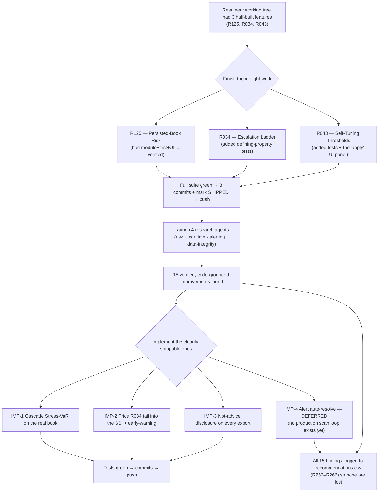
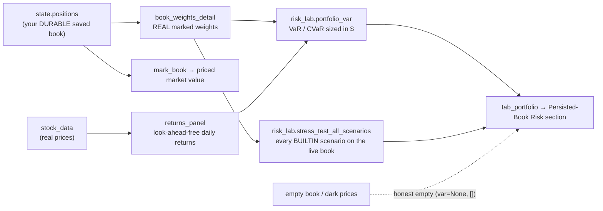
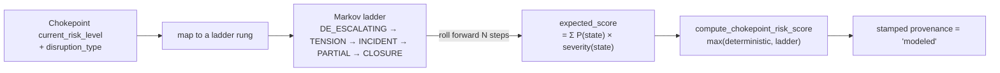
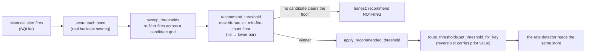
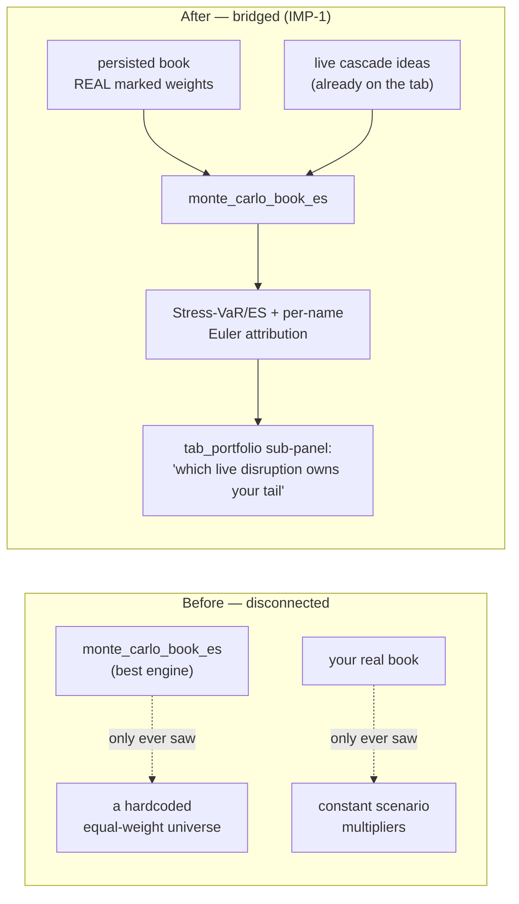
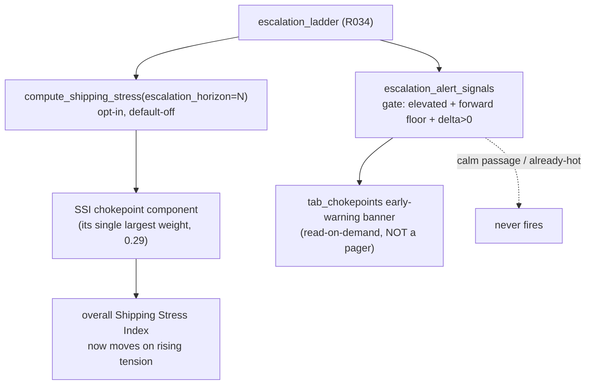
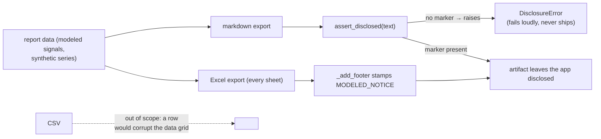
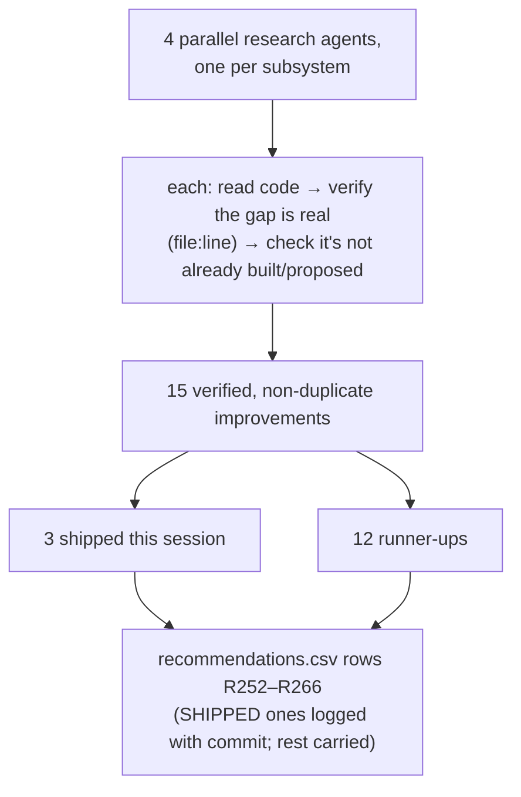
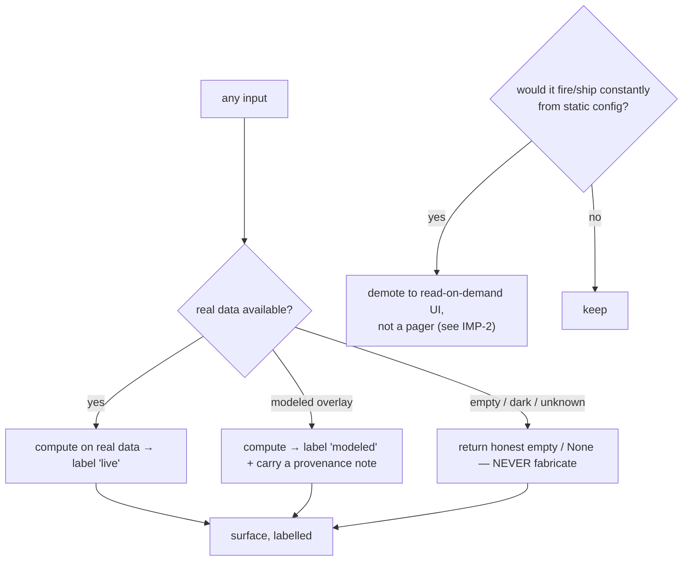
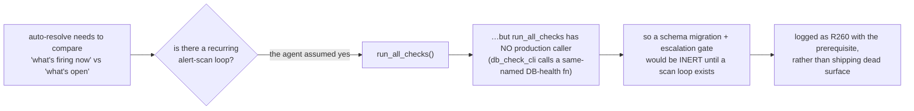

# Session 2026‑06‑17 — How it was put together & how it works

A plain‑language, diagram‑first walkthrough of everything shipped in this session,
so a new reader can follow the *why*, the *flow*, and *where the code lives*
without reading every file. Diagrams are [Mermaid](https://mermaid.js.org) — they
render on GitHub and in most Markdown viewers.

The one rule that governs every box below: **real data or an honest empty — never
a fabricated number; every modeled layer is stamped `modeled`.**

---

## 1. The big picture — what happened, in order

**Reading it:** the left spine is *do the work that was already started*, the right
spine is *find and add more*. Anything that couldn't be shipped *honestly and
completely* this session was written down as a tracked backlog item instead of
half-built (see §6 on IMP‑4).

---

## 2. The three features that were already in flight

### R125 — Persisted‑Book Risk *(risk a desk actually runs each morning)*

*The point:* the risk cards run on the user's **actual** book and **real** returns,
not a hardcoded universe and not an `rng.normal` simulation.
Module: `processing/persisted_book_risk.py` · Tests: `tests/test_persisted_book_risk.py`.

### R034 — Escalation Ladder *(price the probability path, not a binary state)*

*The point:* a passage at TENSION with a real road to CLOSURE scores **above** its
current deterministic level — the model prices the tail. The blend is `max(...)`, so
the ladder can only *raise* risk, never lower the deterministic floor; and it is
**opt‑in** (default off → byte‑for‑byte the old numbers).
Module: `processing/escalation_ladder.py` · Tests: `tests/test_escalation_ladder.py`.

### R043 — Self‑Tuning Thresholds *(close the loop: recommend + apply)*

*The point:* the operator no longer hand‑edits SQLite — the panel re‑scores each
alert type, recommends the bar that maximizes hit‑rate (refusing to trust a
2‑fire 100% fluke), and applies it reversibly.
Modules: `engine/alert_backtest.py`, `engine/route_thresholds.py` ·
UI: `ui/tab_alerts.py` (Self‑Tuning Thresholds panel) ·
Tests: `tests/test_threshold_tuner.py`.

---

## 3. The four research‑driven improvements

### IMP‑1 — Cascade Stress‑VaR on the REAL book *(the two halves that never met)*

The user's real book is finally stressed by the **live disruption** the cascade
already scored, and the exact per‑name Euler split exposes a hidden shared bet
("3 of your names are secretly one Suez trade").
Added to `processing/persisted_book_risk.py` (`persisted_book_stress_var`).

### IMP‑2 — Price the R034 tail into the flagship index + an early warning

Before this, the ladder touched exactly one UI table and the headline index ran on
the bare deterministic score. *Why a banner and not a paging alert?* The chokepoint
registry carries **standing** state, so a registry‑driven pager would fire forever
from static config — see §5 (honesty/anti‑noise).
Touched: `processing/shipping_stress_index.py`, `processing/escalation_ladder.py`,
`ui/tab_chokepoints.py`.

### IMP‑3 — Not‑advice disclosure on every export

The PDF/HTML reports were already disclosed (R005); the markdown + Excel files —
the ones that travel to Slack/Notion/email — were not. Now they carry a
`not investment advice` marker and a gate enforces it.
New: `utils/disclosure.py` · Touched: `utils/markdown_export.py`, `utils/excel_export.py`.

---

## 4. How the research was done (and why nothing was lost)

Every agent was required to *prove* a gap with `file:line` evidence and confirm it
wasn't a duplicate of the 251 existing recs — so the backlog stays honest.

---

## 5. The honesty / anti‑noise model (the invariant behind every decision)

Two corollaries that shaped real decisions this session:
- **No fabrication:** every new risk path returns an honest empty on dark prices
  instead of an `rng.normal` stand‑in.
- **No dead/noisy surface:** the R034 escalation signal became a UI banner (not a
  pager) precisely because a registry‑driven pager would be constant noise; and
  IMP‑4 was *deferred* rather than half‑wired (next section).

---

## 6. What was deliberately NOT shipped — IMP‑4 (alert auto‑resolve)

The highest‑value finding (recovered CRITICAL alerts keep paging up the chain
forever, because escalation gates only on `acknowledged = 0`) was **deferred**, not
forced. Why:

Building the scan loop first is the right next step — captured as **R260** in
`recommendations.csv`.

---

## 7. Module index (file → role → tests)

| File | Role | Tests |
|------|------|-------|
| `processing/persisted_book_risk.py` | Persisted‑book VaR + scenario stress (R125) **and** cascade Stress‑VaR (IMP‑1) | `tests/test_persisted_book_risk.py` |
| `processing/escalation_ladder.py` | Markov escalation ladder (R034) + early‑warning signal gate (IMP‑2) | `tests/test_escalation_ladder.py` |
| `processing/shipping_stress_index.py` | SSI; gained the opt‑in `escalation_horizon` seam (IMP‑2) | `tests/test_shipping_stress_index.py` |
| `engine/alert_backtest.py` | Backtest + sweep/recommend/apply self‑tuning loop (R043) | `tests/test_threshold_tuner.py` |
| `engine/route_thresholds.py` | Override store; gained reversible `set_threshold_for_key` (R043) | `tests/test_threshold_tuner.py` |
| `utils/disclosure.py` | Single source of the export not‑advice notice + `assert_disclosed` gate (IMP‑3) | `tests/test_export_disclosure.py` |
| `ui/tab_portfolio.py` · `ui/tab_chokepoints.py` · `ui/tab_alerts.py` | The UI surfaces for the above | `tests/test_tab_smoke.py` |
| `recommendations.csv` | The improvement backlog (R252–R266 added this session) | — |

> Pending integration as this doc was written: three more pure modules from
> background agents — `closure_scenario.py` (R258), `sized_book_risk.py` (R255),
> `signal_path_stats.py` (R256). They follow the same pattern and will appear in
> this table once merged.
